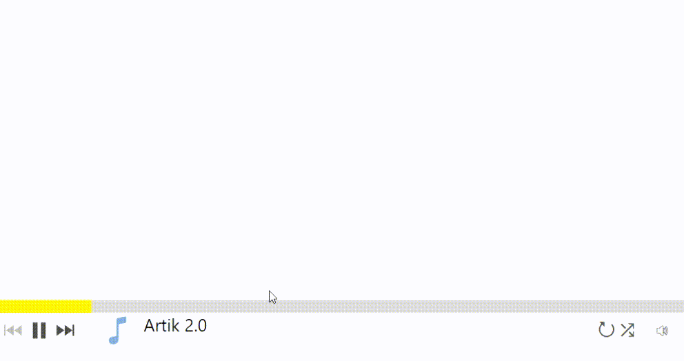

# AudioPlayer

Standalone Wpf color picker

[](https://www.nuget.org/packages/StounhandJ.AudioPlayer/)

## Installation
[Install nuget package here](https://www.nuget.org/packages/StounhandJ.AudioPlayer/)

## Usage
1. Create an element in xml
```xml
<Window
    xmlns:AudioPlayer="clr-namespace:AudioPlayer;assembly=AudioPlayer">
    <Grid>
        <AudioPlayer:Player Name="CustomPlayer"/>
    </Grid>
</Window>
```
2. Create a playlist and add to player
```c#
Playlist list = new Playlist(new List<Music>
            {
                new Music {source = new Uri(directory + "audioTest/Artik.mp3"), name = "Artik 2.0"},
                new Music {source = new Uri(directory + "audioTest/Rasa.mp3"), sourceImg = new Uri("https://avatars.mds.yandex.net/get-zen_doc/1591494/pub_5d05c6ad97d1910df850692d_5d05daefcf474f0da0398c8f/scale_1200")},
                new Music {source = new Uri(directory + "audioTest/MATRANG.mp3")},
                new Music {source = new Uri(directory + "audioTest/Rakhim.mp3"), name = "Dance", sourceImg = new Uri(directory + "imgTest/slon.jpg")},
            });
CustomPlayer.SetPlayList(list);
```
OR one music
```c#
CustomPlayer.SetMusic(new Music {source = new Uri(directory + "audioTest/Artik.mp3"), name = "Artik 2.0"});
```

## Others methods

### Playback control
```c#
CustomPlayer.Stop(); // Stop play music
CustomPlayer.Play(); // Run play music
CustomPlayer.SetVolume(volume); // Set volume music (volume from 0 to 1)
CustomPlayer.StartReplay(); // Enables track replay
CustomPlayer.StopReplay(); // Disables track replay
CustomPlayer.NextMusic(); // Play next music
CustomPlayer.LastMusic(); // Play last music
CustomPlayer.PickNumberMusic_PlayList(index); // Play music under the number (index from scratch)
CustomPlayer.PickMusic_PlayList(music); // Play music if in playlist
CustomPlayer.MixPlayList(); // Shuffle playlist
```

### Manage playlist
```c#
CustomPlayer.AddMusic_PlayList(music); // Add music to a playlist
CustomPlayer.RemoveMusic_PlayList(music); // Delete music from a playlist
```