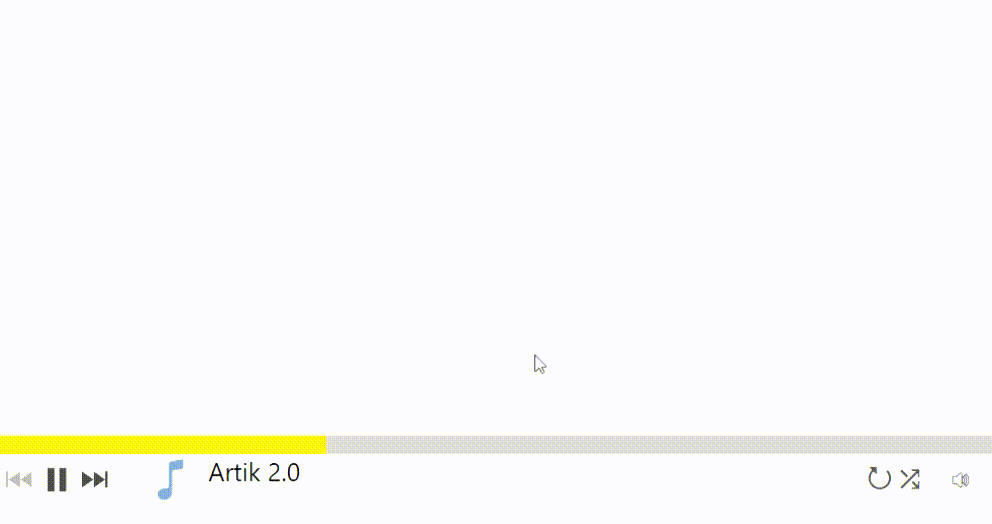

# AudioPlayer

Built-in audio player, with full access to the settings of the user and the developer. Support for Internet resources.

[](https://www.nuget.org/packages/StounhandJ.AudioPlayer/)

## Installation
[Install nuget package here](https://www.nuget.org/packages/StounhandJ.AudioPlayer/)

## Usage
1. Create an element in xml
```xml
<Window
    xmlns:AudioPlayer="clr-namespace:AudioPlayer;assembly=AudioPlayer">
    <Grid>
        <AudioPlayer:Player Name="CustomPlayer"/>
    </Grid>
</Window>
```
2. Create a playlist and add to player
```c#
Playlist list = new Playlist(new List<Music>
            {
                new Music {source = new Uri(directory + "audioTest/Artik.mp3"), name = "Artik 2.0"},
                new Music {source = new Uri(directory + "audioTest/Rasa.mp3"), sourceImg = new Uri("https://avatars.mds.yandex.net/get-zen_doc/1591494/pub_5d05c6ad97d1910df850692d_5d05daefcf474f0da0398c8f/scale_1200")},
                new Music {source = new Uri(directory + "audioTest/MATRANG.mp3")},
                new Music {source = new Uri(directory + "audioTest/Rakhim.mp3"), name = "Dance", sourceImg = new Uri(directory + "imgTest/slon.jpg")},
            });
CustomPlayer.SetPlayList(list);
```
OR one music
```c#
CustomPlayer.SetMusic(new Music {source = new Uri(directory + "audioTest/Artik.mp3"), name = "Artik 2.0"});
```

## Others methods

### Parameters
```c#
CustomPlayer.StyleBackground // Main color the Audio player
```
-----
### Event
```c#
CustomPlayer.MusicStart // Event when the track starts playing
CustomPlayer.MusicEnded // Event at the end of track playback
```
-----
### Playback control
```c#
CustomPlayer.SetPlayList(Playlist) // Sets a playlist and plays it back
CustomPlayer.SetMusic(Music) // Set a Music and play it back
CustomPlayer.Stop() // Stop play music
CustomPlayer.Play() // Run play music
CustomPlayer.SetVolume(int) // Set volume music (volume from 0 to 1)
CustomPlayer.MuteVolume(bool) // Mute or unmute
CustomPlayer.IsMuteVolume():bool // Is mute install
CustomPlayer.StartRandom() // Enables shuffle playlist
CustomPlayer.StopRandom() // Disables shuffle playlist
CustomPlayer.StartReplay() // Enables music replay
CustomPlayer.StopReplay() // Disables music replay
CustomPlayer.NextMusic() // Play next music
CustomPlayer.LastMusic() // Play last music
CustomPlayer.getNowMusicIndex():int // Get number play music
CustomPlayer.getNowMusic():Music // Get number play music
CustomPlayer.PickNumberMusic_PlayList(int) // Play music under the number (index from scratch)
CustomPlayer.PickMusic_PlayList(Music) // Play music if in playlist
```
----
### Manage playlist
```c#
CustomPlayer.AddMusic_PlayList(Music) // Add music to a playlist
CustomPlayer.RemoveMusic_PlayList(Music) // Delete music from a playlist
```
-----
## Class
###Music
```c#
Uri source // The path to music
string name // Music name
Uri sourceImg // The path to image
```
###Playlist
```c#
string name; // Playlist name

Add(Music) // Add music to the playlist
Del(Music) // Delete music to the playlist
SetIndex(int):bool // Sets the playing music by index
SetMusic(Music):bool // Sets the playing music
RandomPlayList() // Shuffles the playlist
StandartPlayList() // Sets the original playlist
Next():Music? // Switches to the next music
Last():Music? // Switches to the last music
IsNextMusic():bool // Is there next music
IsLastMusic():bool // Is there last music
getIndex():int // Index of the playing music
getNow():Music // Returns the music playing now
```
----
An example of the application can be viewed [here](https://github.com/StounhandJ/AudioPlayer/tree/master/AudioPlayerTest)